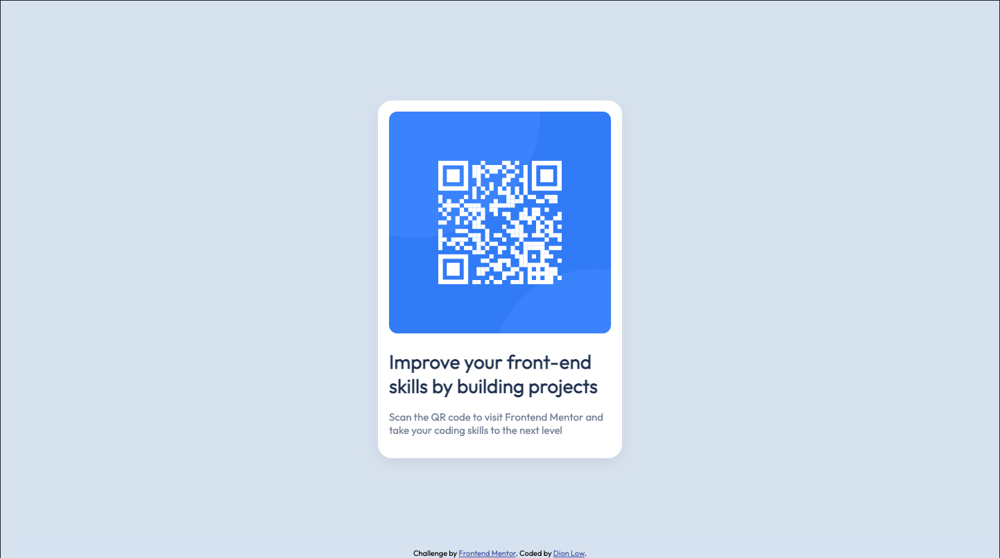

# Frontend Mentor - QR code component solution

This is a solution to the [QR code component challenge on Frontend Mentor](https://www.frontendmentor.io/challenges/qr-code-component-iux_sIO_H). Frontend Mentor challenges help you improve your coding skills by building realistic projects. 

Keeping this project simple has reminded what can be done with just basic css and html. This project is under 50 lines of code and doesn't need any fancy SASS processor or even a separate file. 

## Table of contents

- [Overview](#overview)
  - [Screenshot](#screenshot)
  - [Links](#links)
- [My process](#my-process)
  - [Built with](#built-with)
  - [What I learned](#what-i-learned)
  - [Useful resources](#useful-resources)
- [Author](#author)


## Overview

## Screenshot


#### Mobile Screenshot


#### Desktop Screenshot


### Links

- Solution URL: [Add solution URL here](https://your-solution-url.com)
- Live Site URL: [Add live site URL here](https://your-live-site-url.com)

## My process

I treated this project like a first commit. I wanted to keep the tech simple and high quality. 

### Built with

- Semantic HTML5 markup
- CSS custom properties
- Flexbox

### What I learned

An example thing that I learned was how to import google fonts so that I don't need to download a local copy. Most of the magic of happens in the `<body>` css. Flexbox allows us to elegantly center the qr container without the negative margin hack. The margin and vertical padding is set to 0 so that the 100vh can set and not need a vertical scroll. Content-box is set to explicitly follow box model and allow height, margin, and padding to be set accordingly.

```css
@import url('https://fonts.googleapis.com/css?family=Outfit&display=swap');
    body { 
      box-sizing: content-box;
      margin: 0;
      padding: 0 12px;
      height: 100vh;
      background-color: hsl(212, 45%, 89%); 
      font-family: Outfit; 
      display: flex;
      justify-content: center;
      align-items: center;
      font-family: 'Outfit', sans-serif;      
    }
```

### Useful resources

- [getcssscan.com](https://getcssscan.com/css-box-shadow-examples) - example box shadows 

## Author

- Frontend Mentor - [@dionlow](https://www.frontendmentor.io/profile/dionlow)

